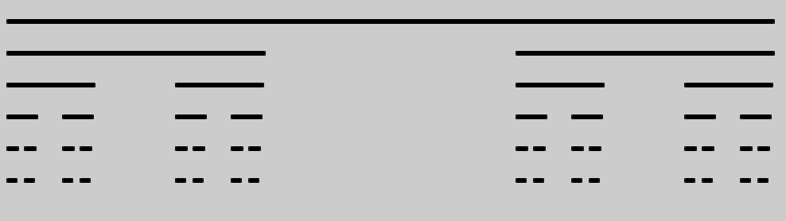
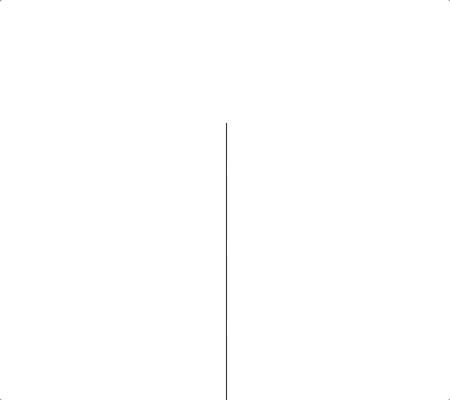
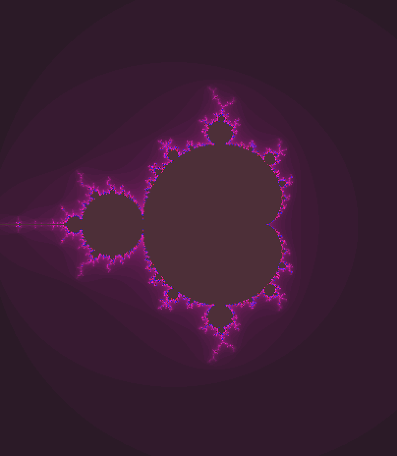
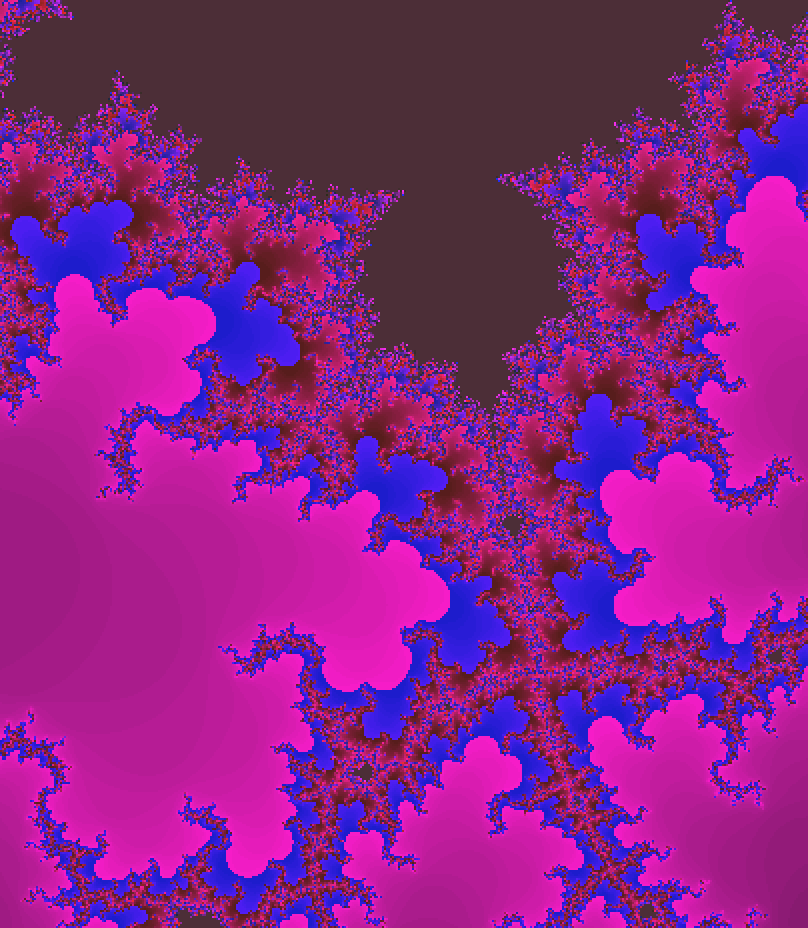
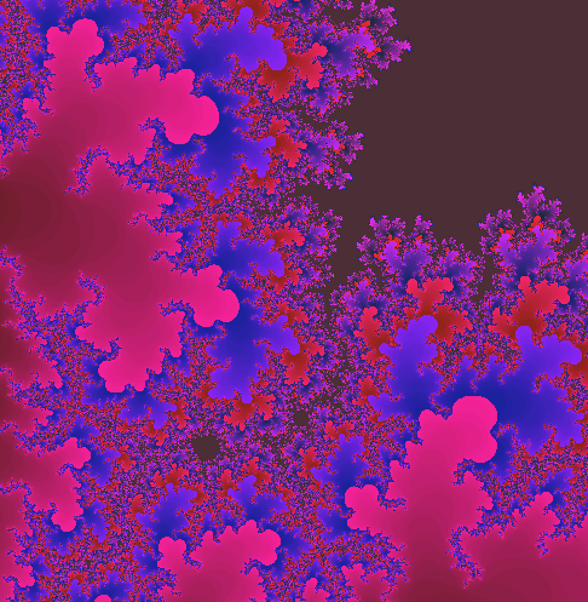
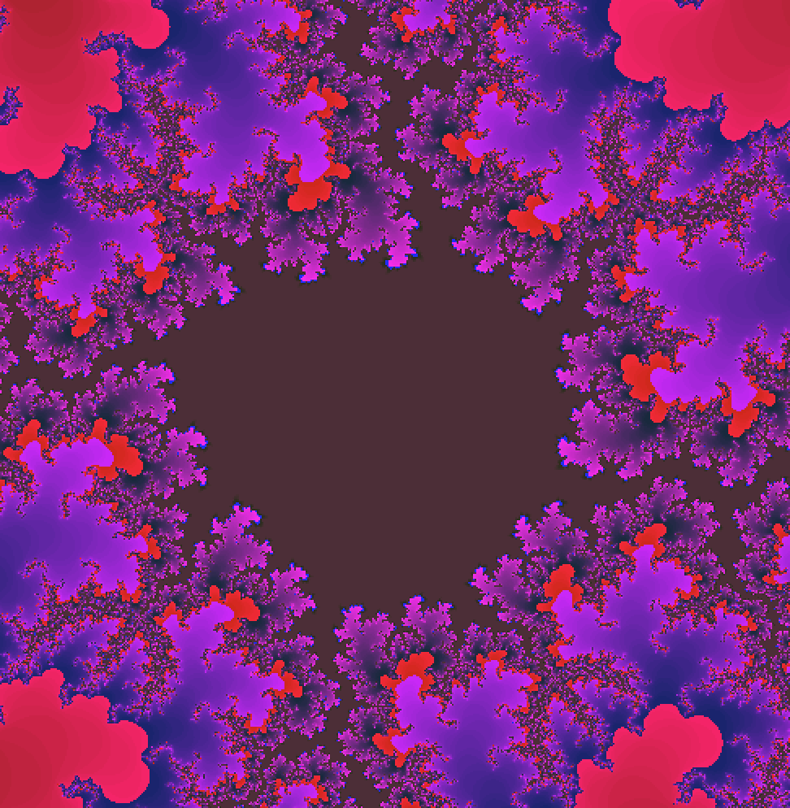
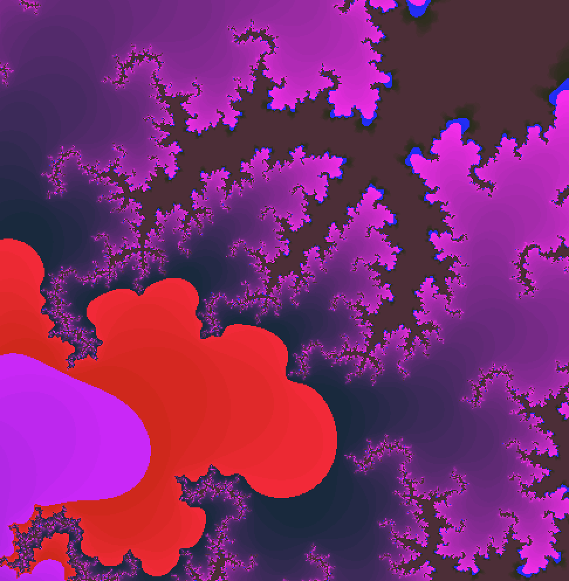
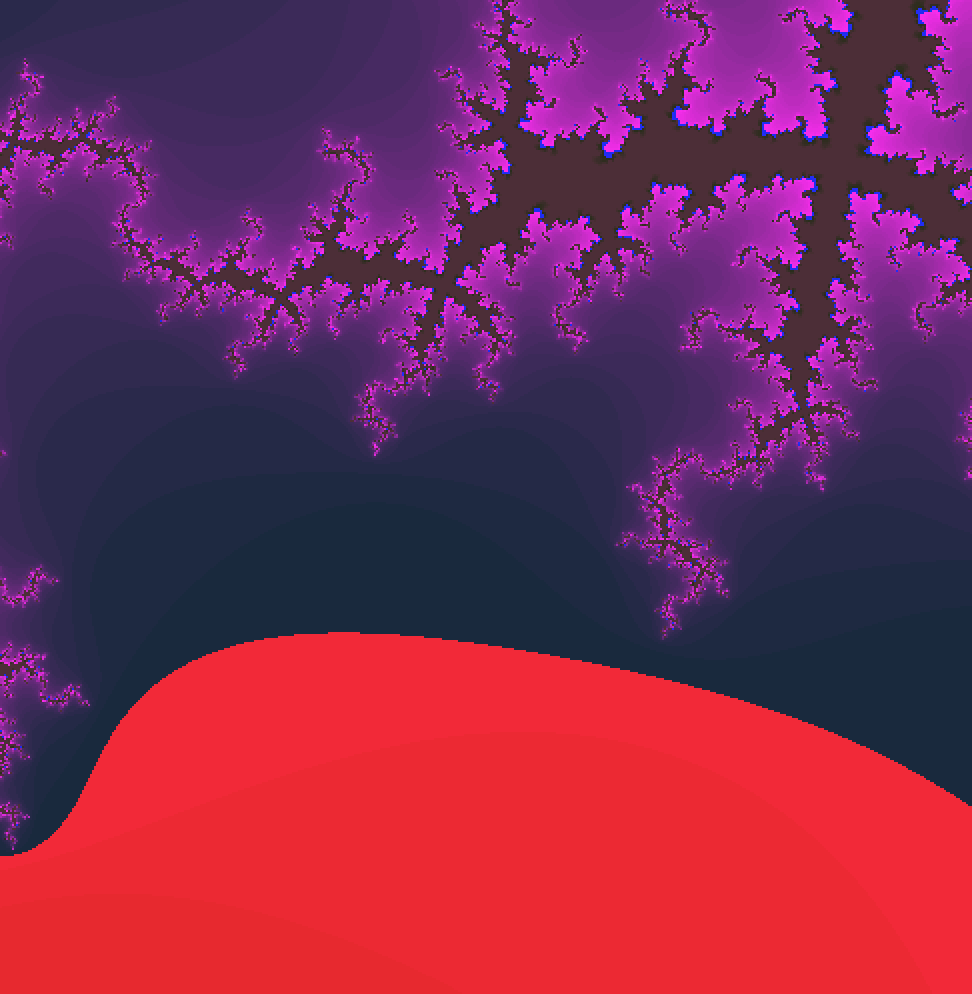
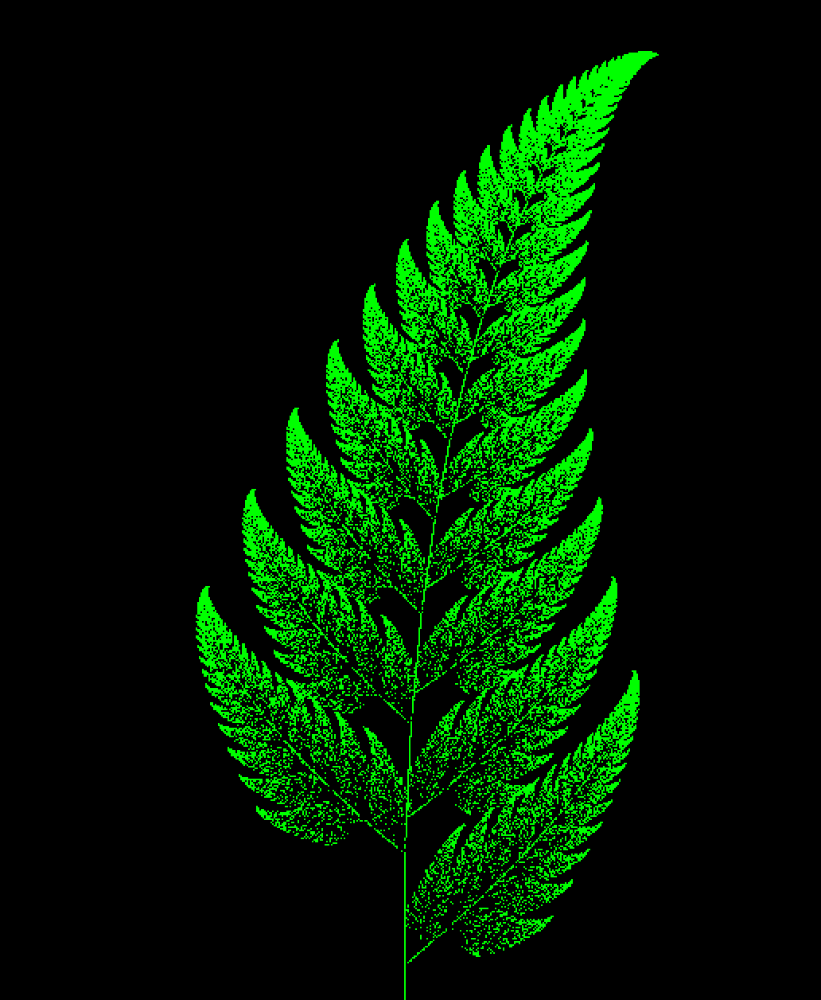

# Generating Fractals With Recursion

## Table of Contents

- [About](#about)
- [Getting Started](#getting_started)
- [Installation](#install)
- [Included Fractals](#fractals)
- [Credit](#credit)

## About 

This repository serves as a source for the article: 

### ***Generating Fractals with Recursion: Python and Processing.py edition***

Included is the source code for the code used in the article, as well as the images. 

---

## __Getting Started__ 

To setup Processing.py:
+ Install Processing [here](https://processing.org/download/)
+ Once installed, follow the instructions [here](https://py.processing.org/tutorials/gettingstarted/) to convert to Python mode
---
## __Installation__ 

To download and run the code locally on your device:
+ go to your terminal
+ run the following command
`git clone https://github.com/RobotGyal/Generating-Fractals-with-Recursion.git`
+ Run Processing and open the desired .pyde file.

or 

+ Vist [Robotgyal/Gists](https://gist.github.com/RobotGyal) to download individual code snippets

---

## __Included Fractals__ 

+ Cantor
    - 
+ Fractal Tree
    - 
+ Mandelbrot Set
    - 
    - 
    - 
    - 
    - 
    - 
+ Barnsleys Fern
    - 
+ Lorenz Attractor
    - 

## __Credit/Contributors__ 

This project and article are a result of an Technical Article Final for Computer Science 1.3, taught by Jess Dahmen at Make School

Contributors: 

+ Aleia Knight - [Robotgyal](github.com/robotgyal)
    - Writer
    - Lead Developer